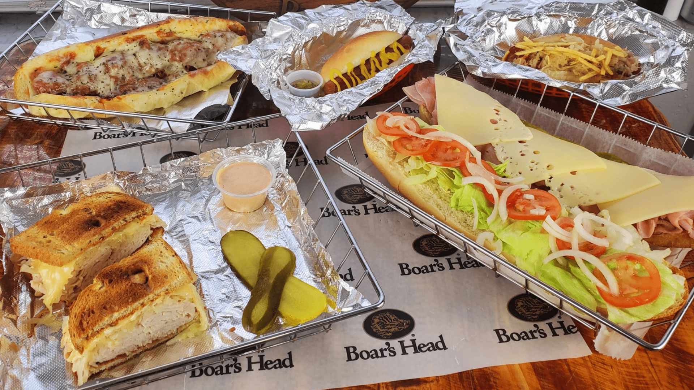
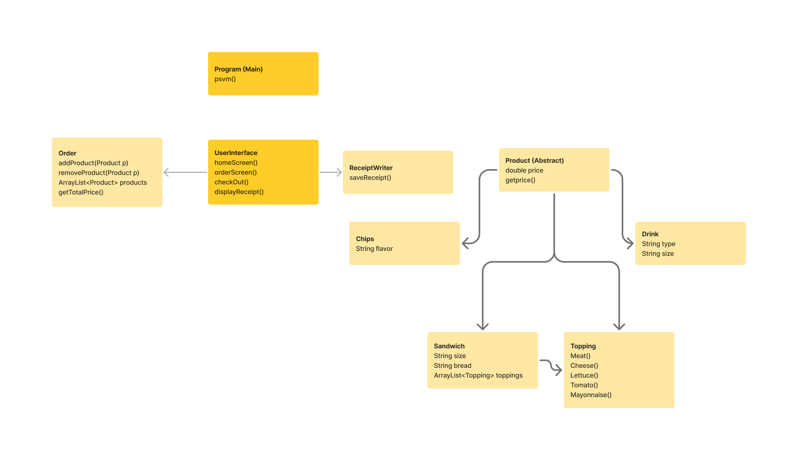
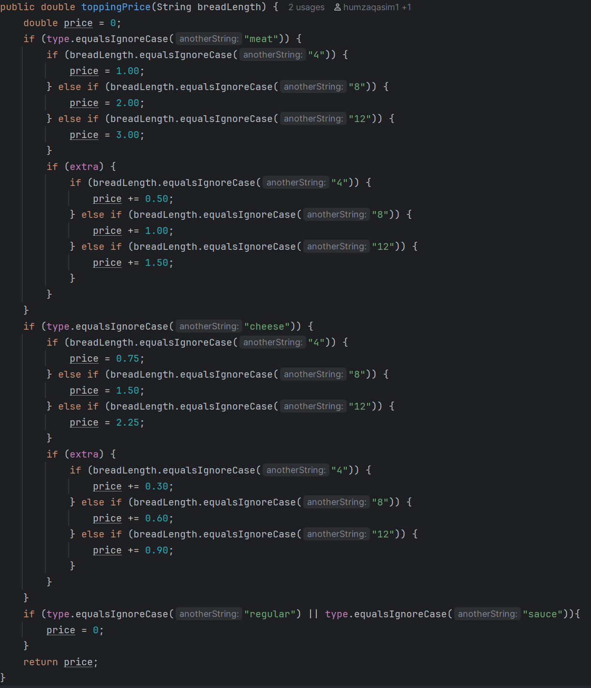
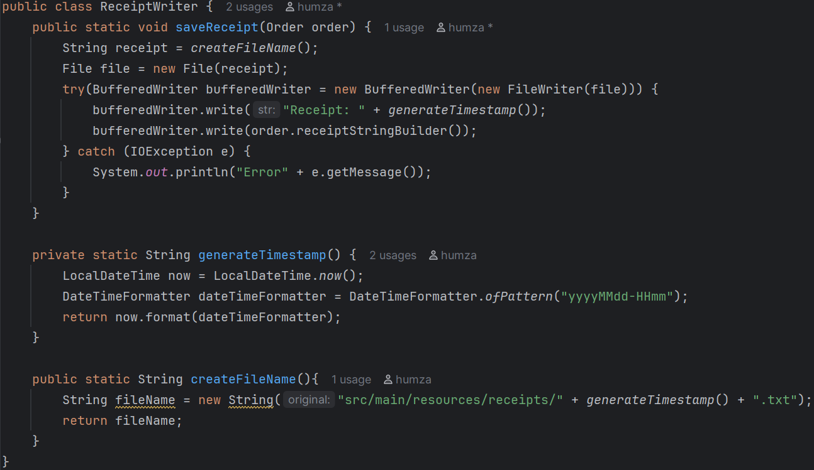

# Capstone 2: Humza's Deli

## by Humza Qasim

### Description:
A Java command-line application for a sandwich shop that allows customers to build custom orders with sandwiches, drinks, and chips.
This project is a point-of-sale system for a deli/sandwich shop. Users can customize sandwiches with different breads, meats, cheeses, toppings, and sauces. The system calculates prices based on sandwich size and premium ingredients, then generates a receipt for the order.

### Features:
- Build custom sandwiches with multiple topping options
- Add drinks and chips to orders
- Automatic price calculation based on size and premium toppings
- Receipt generation and file storage
- Interactive command-line interface

### Class Diagram: 

### Interesting Code:
The most challenging part of this project was implementing the pricing system. Each sandwich size has a different base price, and premium toppings (meats and cheeses) also scale with size. I used a Topping class that calculates its own price based on the sandwich size, which keeps the code clean and follows object-oriented principles.
Another interesting feature is the receipt system. The ReceiptWriter class saves each order to a timestamped file, so the shop can keep track of all transactions.

### Picture example:

### Future Improvements

- Make signature sandwich options
- More DRY code
